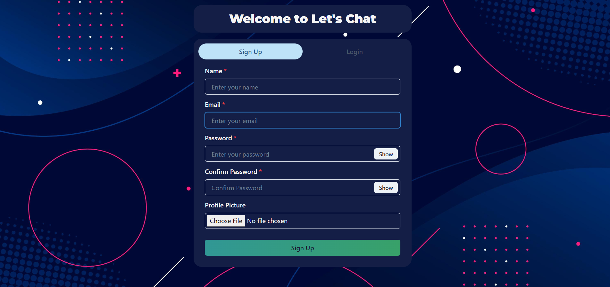
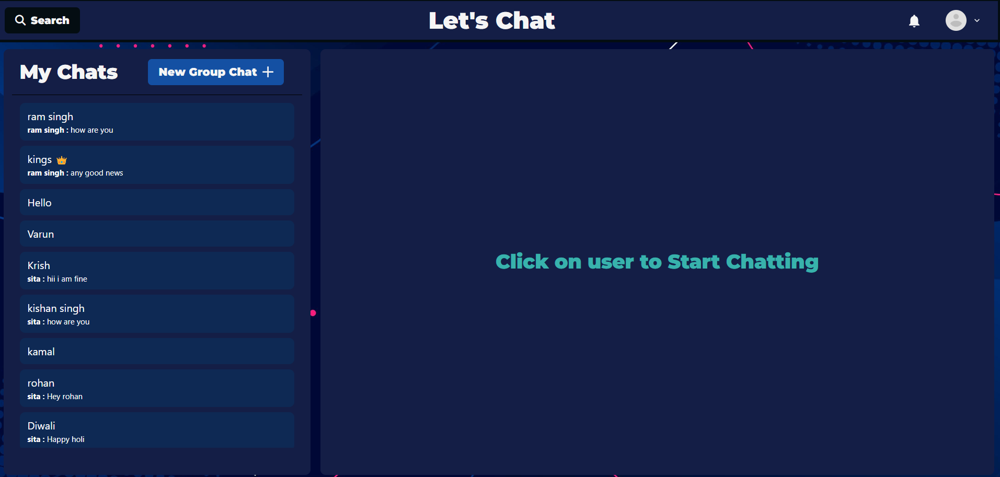
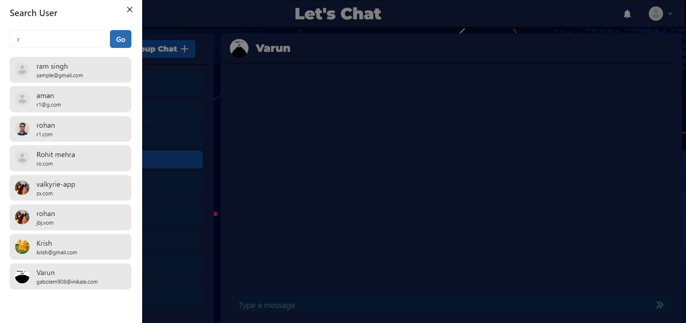
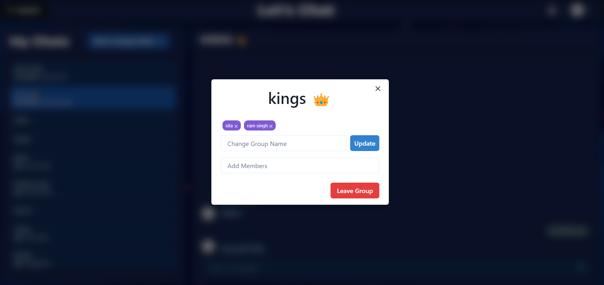

# Let's Chat

A real-time chat application enabling users to communicate seamlessly across devices with secure authentication and persistent message history.

---

## Features

### Real-Time Messaging
- Instant message delivery using **Socket.io**.
- Persistent message history with database integration.
- Active user status updates for enhanced visibility.

### Search and Group Chat
- **Search Feature**: Quickly find users or messages.
- **Group Chat**: Create and participate in group conversations.
- **Update Group Members**: Add or remove members from groups dynamically.

### Authentication
- User registration and login functionality.
- Secure user authentication using **bcrypt** for password hashing.
- Unique user identification and session management.

### Frontend
- Built with **React.js** for responsive and interactive UI.
- Fully responsive design for seamless use across devices.

### Backend
- REST APIs for managing users, messages, and authentication.
- WebSocket integration with **Socket.io** for real-time communication.

---

## Technologies Used

### Backend
- **Node.js** and **Express.js**: Server-side framework.
- **MongoDB**: NoSQL database for storing user data and messages.
- **Socket.io**: Real-time communication library.
- **bcrypt**: Library for secure password hashing.

### Frontend
- **React.js**: UI development.
- **Chakra UI**: Styling for pages and components.
- **Render**: Deployment platform for the frontend.

---

## Prerequisites

- Node.js and npm installed on your system.
- MongoDB database setup (local or cloud, e.g., MongoDB Atlas).

---

## Setup Instructions

### 1. Clone the Repository
```bash
git clone <repository-url>
cd <repository-directory>
```

### 2. Backend Setup
Navigate to the backend directory:

```bash
cd backend
```

Install dependencies:

```bash
npm install
```

Create a .env file in the backend directory and add the following:

```env
PORT=5000
MONGO_URI=<your-mongo-db-uri>
JWT_SECRET=<your-jwt-secret-key>
```

Start the backend server:

```bash
npm start
```

### 3. Frontend Setup
Navigate to the frontend directory:

```bash
cd frontend
```

Install dependencies:

```bash
npm install
```

Start the React development server:

```bash
npm start
```

---

## Screenshots

1. **SignUp Page**

   

2. **Home Page**

   

3. **Search Feature**

   

4. **Group Management**

   

---
